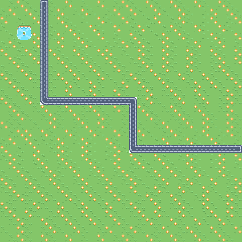

# CS 77 Final Project-- Miranda Scully 

## Overview 
In this project, I implement features found in simple 2D top-down video games. All of my tilemaps and sprite sheets were found online. Any code that I took or modified from other projects is indicated via comments in Tile_Map.v

## Features 

### Tile-map based render 
First,  I implemented a tile map based rendering system for my game. The tilemap encodes different textures with numbers, and the generates a game map from a 2D array of integers, which I store in json files for convenience and aesthetic purposes.  
Demo:  

### Sprite-sheet based character movement 
Second, I implemented a sprite sheet based character generation with funcionality to iterate through the different sprites in an action state and create a folder of images to represent that character movement. Here is a sample of player movement (jump) on a blank png image 

### Particles 
Finally, I implemented particles to mimic the physical response of the environment upon the character movement. Each type of action that my sprites can do (attack, jump, climb, run, walk, and die) has a specific framework that dictates how the environment responds to player movement. To be completely honest, all the numbers for the particle framework were determined by guess and check based on what looks the most real. I had trouble using physics to determine the movement of the particles because both the particles and characters are so small and the movements are occuring over such a small number of frames. There are definetly ways I could improve this aspect of my project if I continued to work on it in the future. For instance, a lot of the numbers related to the positions of a character's body parts are hardcoded, if I had had more time I would've done a better job setting these values as constants. It was kind of tricky because the sprite images change size slightly in every different movement/state, and obviously the placement of the character's body parts change as it moves. 
Demo (run action): **Note, the particles were hard coded magenta to make them easier to see  

## Creative Artifact 
For my creative artifact I used a gif maker to make a gif of a complete player movement, on my tile-map rendered game map, featuring particles in response to their movement. Here I showcase four gifs, showing "run" (with 2 iterations), "die", "attack", and "walk". **Note, the gif software is a little weird for a lot of frames, so the run gif looks a little weird.  

# tilemap_project
